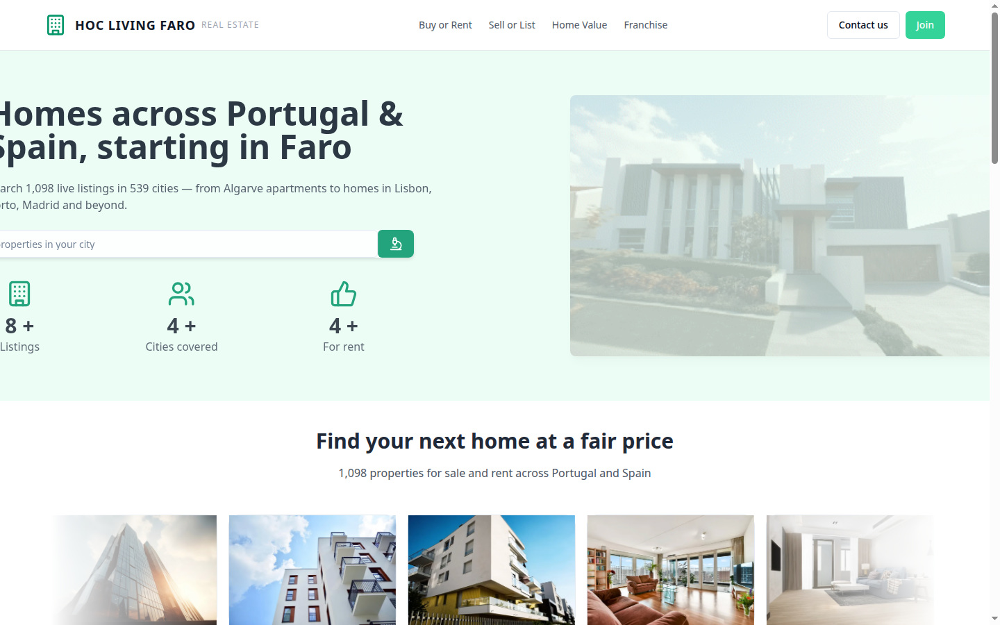
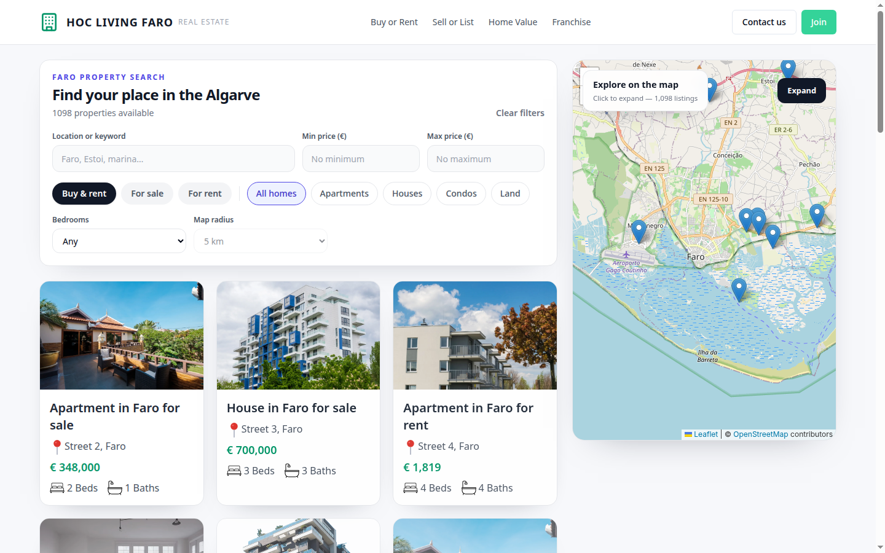
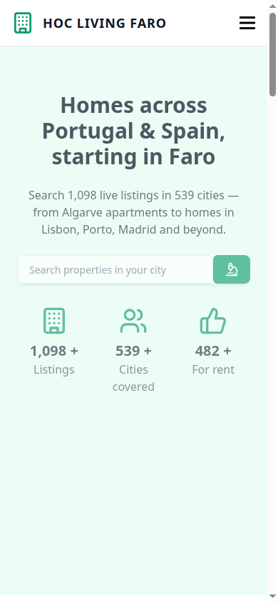
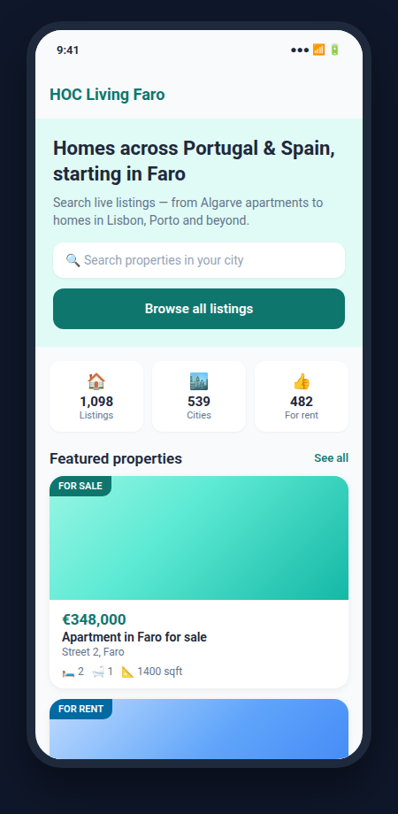
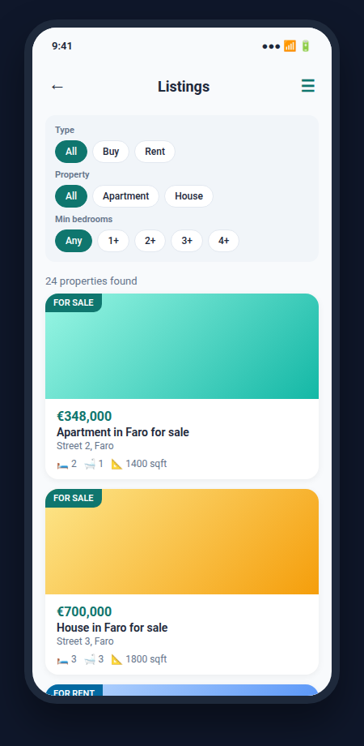
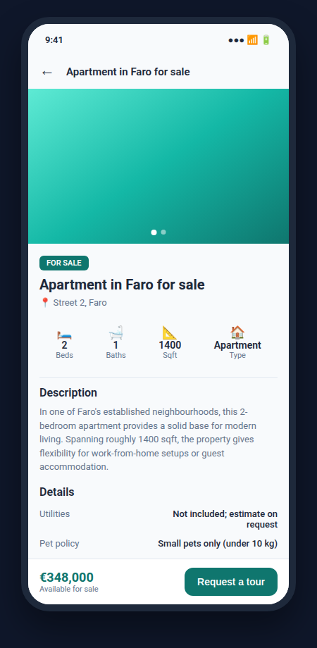
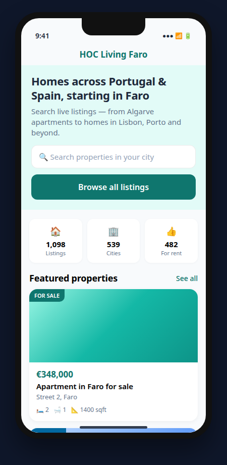
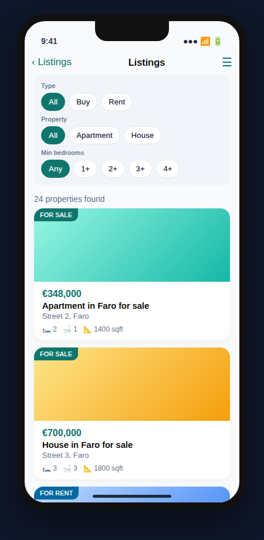
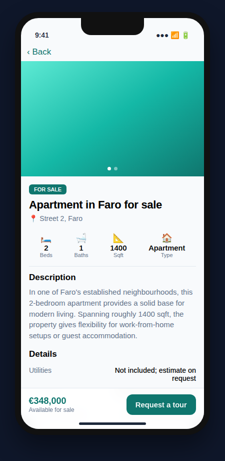

# HOC Living Faro

### Cross-platform real estate platform for Portugal & Spain — starting in the Algarve

**Live Web App → [hoc-living-faro-real-estate-web-app.vercel.app](https://hoc-living-faro-real-estate-web-app.vercel.app)**

[](#web-application)
[](#android-application)
[](#ios-application)
[](https://hoc-living-faro-real-estate-web-app.vercel.app)
[](#)

---

## Why this product exists

Southern Europe’s property market is fragmented. Buyers, renters, and investors jump between Idealista, Imovirtual, agency sites, and WhatsApp threads. **HOC Living Faro** unifies discovery, filtering, map search, and lead capture into one polished experience — on **web, Android, and iOS** — with Faro and the Algarve as the beachhead, expanding across **Portugal and Spain**.

| Metric | Value |
|--------|--------|
| Live listings in catalog | **1,098+** |
| Cities covered | **539+** |
| Listings for rent | **482+** |
| Platforms | Web · Android · iOS |
| Primary markets | Faro · Algarve · Lisbon · Porto · Madrid |

---

## Product at a glance

| Capability | Web | Android | iOS |
|------------|:---:|:-------:|:---:|
| Property search & filters | ✅ | ✅ | ✅ |
| Interactive map (Leaflet) | ✅ | — | — |
| Property detail + gallery | ✅ | ✅ | ✅ |
| Request a tour / lead CTA | ✅ | ✅ | ✅ |
| Home value / sell / franchise pages | ✅ | — | — |
| Contact, experts, blog, FAQ | ✅ | — | — |
| Native Material 3 / SwiftUI UX | — | ✅ | ✅ |

---

## Screenshots

### Web — Desktop

**Landing**



> Hero, live counters (1,098 listings · 539 cities · 482 for rent), search, featured inventory.

**Listings + map**



> Full filter stack (buy/rent, type, price, bedrooms, map radius), card grid, expandable Leaflet map over Faro / Algarve.

**Web — Mobile**



> Responsive landing optimized for mobile browsers.

---

### Android — Kotlin · Jetpack Compose · Material 3

| Home | Listings | Detail |
|:----:|:--------:|:------:|
|  |  |  |

- Teal brand system aligned with web  
- Filter chips: type · property · min bedrooms  
- Image-ready cards, price formatting (EUR), tour request CTA  

---

### iOS — Swift · SwiftUI

| Home | Listings | Detail |
|:----:|:--------:|:------:|
|  |  |  |

- Native NavigationStack, SF Symbols, system materials  
- Same data model and filter logic as Android  
- Bottom bar with price + “Request a tour”  

---

## Architecture overview

```
┌─────────────────────────────────────────────────────────────┐
│                     HOC Living Faro                         │
├──────────────┬──────────────────────┬───────────────────────┤
│     Web      │       Android        │         iOS           │
│  React 18    │  Kotlin + Compose    │  Swift + SwiftUI      │
│  Vite 5      │  Material 3          │  iOS 16+              │
│  Tailwind 3  │  Navigation Compose  │  NavigationStack      │
│  Leaflet     │  Coil                │  AsyncImage           │
│  Framer Mot. │  Min SDK 26          │  Xcode 15+            │
└──────────────┴──────────────────────┴───────────────────────┘
                              │
                    Shared listing catalog
                 (1,098 properties · Faro focus)
```

**Current data layer:** curated JSON catalog (titles, prices, geo, amenities, policies).  
**Roadmap:** API / CMS backend, auth, favorites, agent CRM, push notifications.

---

## Web application

**Stack**

| Layer | Technology |
|-------|------------|
| UI | React 18, TypeScript |
| Build | Vite 5 |
| Styling | Tailwind CSS 3, Radix UI primitives, class-variance-authority |
| Motion | Framer Motion |
| Maps | Leaflet + React-Leaflet |
| Routing | React Router 6 |
| Deploy | Vercel |

**Key routes**

| Path | Purpose |
|------|---------|
| `/` | Marketing landing + featured inventory |
| `/listings` | Search, filters, map, paginated results |
| `/details/:id` | Property detail, gallery, tour request |
| `/sell` · `/home-value` · `/franchise` | Seller & partner funnels |
| `/contact` · `/join` · `/experts` · `/blog` · `/faq` | Trust & conversion pages |
| `/terms` · `/privacy` · `/sitemap` | Legal & SEO |

**Listings intelligence**

- Filters: keyword, buy/rent, property type, min/max price, bedrooms, **map radius (km)**  
- Haversine distance for radius search around selected map point  
- Expandable full-screen map with property markers  
- Pagination (page size 24)

**Run locally**

```bash
cd Web
npm install
npm run dev
```

Production build: `npm run build` → static assets for Vercel or any CDN.

---

## Android application

**Stack**

| Layer | Technology |
|-------|------------|
| Language | Kotlin |
| UI | Jetpack Compose, Material 3 |
| Navigation | Navigation Compose |
| Images | Coil |
| Min / Target SDK | 26 / 34 |

**Screens**

1. **Home** — Hero, stats, featured properties, value props  
2. **Listings** — Filter chips + scrollable property cards  
3. **Detail** — Horizontal pager, specs, description, policies, sticky CTA  

**Run**

1. Open `Android/` (or `HOCLivingFaroAndroid/`) in Android Studio  
2. Sync Gradle → Run on emulator or device (API 26+)

---

## iOS application

**Stack**

| Layer | Technology |
|-------|------------|
| Language | Swift 5.9+ |
| UI | SwiftUI |
| Navigation | NavigationStack |
| Images | AsyncImage |
| Deployment target | iOS 16.0+ |

**Screens**

1. **Home** — Same narrative as web/Android  
2. **Listings** — Native chips for type / property / bedrooms  
3. **Detail** — TabView gallery, specs grid, bottom bar CTA  

**Run**

1. Open `iOS/HOCLivingFaro.xcodeproj` in Xcode 15+  
2. Select simulator or device → ⌘R  

---

## Repository layout

```
HOC-living-Faro-Real-Estate-WEB-App/
├── Web/                    # React + Vite production app
│   ├── src/
│   │   ├── pages/          # list, details, contact, sell, …
│   │   ├── sections/       # landing blocks
│   │   ├── components/     # UI + map + filters
│   │   └── postsData.json  # listing catalog
│   └── package.json
├── Android/                # Kotlin + Compose (optional companion)
├── iOS/                    # SwiftUI (optional companion)
├── docs/screenshots/       # Product screenshots for this README
└── README.md               # You are here
```

> Mobile projects can live as sibling folders or separate repos; structure above is the recommended monorepo layout for investors and engineers.

---

## Design system

| Token | Value | Usage |
|-------|--------|--------|
| Primary | `#0F766E` (teal) | CTAs, links, badges |
| Rent accent | `#0369A1` | “For rent” labels |
| Background | `#F8FAFC` | Page / screen canvas |
| Text | `#1E293B` / `#64748B` | Primary / secondary copy |

Consistent across web (Tailwind), Android (Material 3 color scheme), and iOS (SwiftUI `AppTheme`).

---

## Roadmap (high level)

| Phase | Focus |
|-------|--------|
| **Now** | Web live on Vercel · native Android & iOS shells with shared catalog |
| **Next** | Backend API, real-time inventory, agent dashboard, favorites |
| **Later** | Auth, CRM integrations, push, multi-language (PT / ES / EN), MapKit / Google Maps on mobile |

---

## Team & contact

**Product & engineering** — [Dpehect](https://github.com/Dpehect) (Yunus Emre Gürlek)

**Live demo** — [hoc-living-faro-real-estate-web-app.vercel.app](https://hoc-living-faro-real-estate-web-app.vercel.app)

For partnership, franchise, or investment inquiries, use the **Contact** / **Join** flows on the live site.

---

## License

Proprietary. All rights reserved. Unauthorized commercial use of branding, listing data, or source is prohibited.

---

<p align="center">
  <b>HOC Living Faro</b> — Homes across Portugal & Spain, starting in Faro.
</p>
